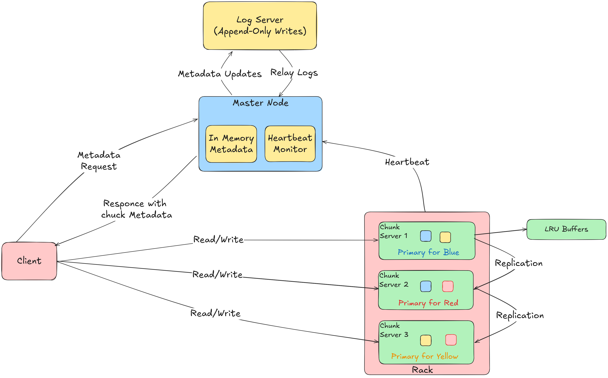

# Distributed File System (GFS Implementation)

An implementation of Google File System (GFS) in Go, featuring centralized metadata management, chunk-based storage, and fault-tolerant replication.

## 🏗️ Architecture Overview

This implementation follows the original GFS paper design with three main components:



### Master Server (Single Node)

- **Centralized Metadata Management**: Maintains file system namespace and chunk metadata
- **Chunk Allocation**: Assigns unique chunk handles and manages replica placement
- **Load Balancing**: Distributes chunks across chunkservers for performance and fault tolerance
- **Persistence**: Operation logs with periodic checkpointing for crash recovery
- **Location**: [`pkg/master/`](pkg/master/)

### ChunkServer

- **Chunk Storage**: Manages 64MB fixed-size chunks on local disk
- **Replica Coordination**: Handles primary replica duties for assigned chunks
- **Heartbeat Protocol**: Reports chunk status and health to master
- **Location**: [`pkg/chunkserver/`](pkg/chunkserver/)

### Client

- **FUSE Interface**: Provides POSIX-like file system operations (implementation choice)
- **Metadata Caching**: Caches chunk locations to reduce master load
- **Direct Data Path**: Communicates directly with chunkservers, bypassing master for data operations
- **Location**: [`pkg/client/`](pkg/client/)

## ✅ Features Status

### **Implemented & Working**

- ✅ **File System Operations**: Create, read, write, delete files and directories
- ✅ **Chunk Management**: 64MB chunks with unique handles and distribution
- ✅ **Replication**: Configurable chunk replication across multiple servers
- ✅ **Fault Tolerance**: Heartbeat monitoring and automatic re-replication
- ✅ **Persistence**: Operation logging with crash recovery
- ✅ **FUSE Interface**: POSIX-like file system mounting and operations
- ✅ **gRPC Communication**: Master-ChunkServer and Client-Master protocols
- ✅ **Metadata Management**: Hierarchical namespace with file attributes

### **Partially Implemented**

- 🟡 **Consistency Control**: Basic version tracking and write coordination
- 🟡 **Performance Optimization**: Limited caching and write buffering
- 🟡 **Advanced Replication**: Primary-secondary coordination needs refinement

### **Not Implemented**

- ❌ **Security**: Authentication, authorization, and access control
- ❌ **Production Features**: Shadow master, monitoring
- ❌ **Advanced Fault Tolerance**: Basic implementation, no automatic recovery
- ❌ **Enterprise Features**: Snapshots, quotas, cross-datacenter replication

## 📊 Performance Benchmarks

Performance characteristics on a typical development setup:

### **File Operations**

| Operation Type              | Throughput    |
|-----------------------------|---------------|
| Small File Write (1KB×1000) | 0.10 MB/s     |
| Small File Read (1KB×1000)  | 1.34 MB/s     |
| Large File Write (10MB×10)  | 65.52 MB/s    |
| Large File Read (10MB×10)   | 216.40 MB/s   |

### **Sequential Access**

| Pattern                     | Throughput    |
|-----------------------------|---------------|
| Sequential Write (100MB)    | 44.89 MB/s    |
| Sequential Read (100MB)     | 218.48 MB/s   |

### **Random Access**

| Pattern                     | Operations/sec |
|-----------------------------|----------------|
| Random Read (50MB dataset)  | 3,899 ops/sec  |

**Note**: Results may vary based on hardware and configuration.

## ⚠️ Important Disclaimer

**This project is built for learning purposes and is not production-ready.**

While I've strived to implement core GFS concepts as faithfully as possible, some aspects are simplified or incomplete. The original GFS paper describes an enormously complex system - implementing every detail would be a multi-year endeavor. This implementation captures the essential distributed file system principles while remaining a manageable educational project.

If you notice missing features or rough edges, that's intentional scope limitation rather than oversight.

## 🚀 Quick Start

### Prerequisites

- Go 1.21+
- Protocol Buffers compiler (`protoc`)
- FUSE library (for client mounting)

### Operating System Compatibility

- **Linux**: Tested and working.
- **Windows**: Might work with **WSL 2**.
- **macOS**: Not tested. [macFUSE](https://osxfuse.github.io/) could potentially be used.

### Installation

```bash
# Install dependencies
sudo apt-get install fuse3 libfuse3-dev protobuf-compiler
go install google.golang.org/protobuf/cmd/protoc-gen-go@latest
go install google.golang.org/grpc/cmd/protoc-gen-go-grpc@latest
```

### Build

```bash
# Generate protobuf code
make proto

# Build all components
make build
```

### Configuration (Optional)

Copy and modify the example environment file:

```bash
cp .env.example .env
# Edit .env with your configuration
```

**Note**: If `.env` file is not found, default values will be used.

### Run the System

#### Option 1: Start All Services with One Command (Recommended)

For quick testing and development, start the complete DFS system with a single command:

```bash
make all
```

This will automatically start:

- 1 Master server (port 8000)
- 5 ChunkServers (ports 9081-9085)
- 1 FUSE Client (mounted at `./mnt`)

The script provides real-time monitoring and graceful shutdown with `Ctrl+C`.

#### Option 2: Start Services Individually

1. **Start Master Server**:

    ```bash
    make master
    ```

2. **Start ChunkServers**:

    ```bash
    # ChunkServer 1
    make chunkserver PORT=8081 STORAGE=chunk_1

    # ChunkServer 2  
    make chunkserver PORT=8082 STORAGE=chunk_2

    # ChunkServer 3
    make chunkserver PORT=8083 STORAGE=chunk_3
    ```

3. **Mount Client**:

    ```bash
    make client
    ```

## 📁 Project Structure

```sh
├── api/                  # Generated gRPC code
│   ├── master/           # Master service definitions
│   ├── chunkserver/      # ChunkServer service definitions
│   ├── common/           # Shared types
│   └── proto/            # Protocol buffer definitions
├── cmd/                  # Main applications
│   ├── master/           # Master server entry point
│   ├── chunkserver/      # ChunkServer entry point
│   └── client/           # FUSE client entry point
├── configs/              # Configuration management
├── pkg/                  # Reusable packages
│   ├── master/           # Master server implementation
│   ├── chunkserver/      # ChunkServer implementation
│   ├── client/           # Client implementation
│   └── common/           # Shared utilities
├── tests/                # System tests and benchmarks
└── deployments/          # Docker and Kubernetes configs
```

## 📚 References

- [The Google File System (2003)](https://www.google.com/url?sa=t&source=web&rct=j&opi=89978449&url=https://research.google.com/archive/gfs-sosp2003.pdf&ved=2ahUKEwjt1IGM5t-NAxWKamwGHavnJdMQFnoECEAQAQ&usg=AOvVaw2bOjX6TrilZNxIhFKWZtBo)
- [gRPC Go Documentation](https://grpc.io/docs/languages/go/)
- [FUSE Documentation](https://github.com/hanwen/go-fuse)
- [Protocol Buffers Guide](https://developers.google.com/protocol-buffers)

## 📄 License

This project is licensed under the MIT License - see the [LICENSE](LICENSE) file for details.
